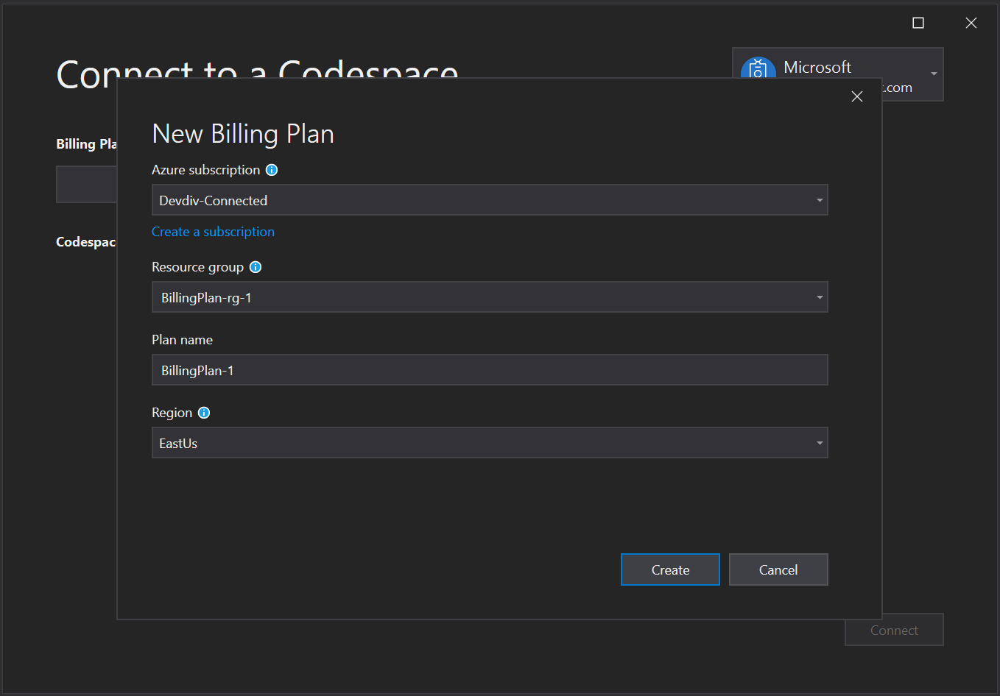

# Visual Studio Codespaces Visual Studio 2019 How-to

## Sign Up

A Microsoft Account and Azure Subscription are required to use Visual Studio Online.

You can sign up for both, as well as receive various Azure incentives at [https://azure.microsoft.com/free/](https://azure.microsoft.com/free/).

Access to the Visual Studio 2019 Limited Preview is also required to complete this How-to. Sign up for the limited preview here [https://aka.ms/vsfutures-signup](https://aka.ms/vsfutures-signup).

## Install

> [!TIP]
> If you don't have [Visual Studio 2019 Preview](http://aka.ms/vspreview) installed already, you can download it [here](http://aka.ms/vspreview). Check the **ASP.NET and web development**, **Desktop development with C++**, or both Workloads in the Installer. Then click **Install**.

Launch Visual Studio 2019 from the Start menu. If you just installed Visual Studio for the first time you'll see a welcome screen where you can sign in with any Microsoft identity.

When you reach Visual Studio's Start Window click **Continue without code**. Now open the **Tools** menu and click **Options...**. Search for **Preview features**. Check the **Connect to Visual Studio Codespaces(private preview only)** checkbox, then click **Ok** and restart Visual Studio.

## Sign in

After you enable the Connect to Visual Studio Codespases preview feature you will see a new **Connect to a Codespace** button in the Start Window and a new **Connect to a Codespace** command under the File menu. Click the **Connect to a Codespace** button. If you aren't already signed with an account that has access to the Limited Preview, click account picker control to expand it in the upper right corner of the dialog and click **Add an account** to sign in.

## Create a plan

Once you've [signed up](#sign-up) and created an Azure subscription, you can access Visual Studio Codespaces by creating a Billing Plan. You can create more than one plan, and plans can be used to group related Codespaces together or to create Codespaces in different regions. Visual Studio Codespace Billing plans are the unit of billing in Azure, so you'll see a line item on your Azure bill for each plan you create.

Users will not be charge for Windows based Codespaces created during the Limited Preview. More information about plans and pricing is available on [the VS Online pricing page](https://aka.ms/vso-pricing).

If this is your first time using Codespaces, click **New...** next to **Billing Plan**. 

- **Azure subscription**: You can any listed Azure subscriptions when creating a billing plan. 
- **Resource group name**: Your Billing plan will be created in a new Azure resource group with the name provided in this step.
- **Plan name**: The name of the created Billing plan. 
- **Region**: Choose an [Azure region](https://azure.microsoft.com/global-infrastructure/regions/) to create the Billing plan. All environments created within this plan, will be provisioned in the region selected. Supported regions are:
  - East US
  - Southeast Asia
  - West Europe
  - West US 2
purposes.

Select the Azure subscription where you want to create the Billing plan and a region geographically close to where you'll use Codespaces; then click **Create**.

You can manage plans in the Azure portal and at http://online.visualstudio.com/environments.

Only environments contained within the selected plan will be displayed. Select a different plan from the drop down on the Connect to a Codespace dialog to see Codespaces created under those plans.
