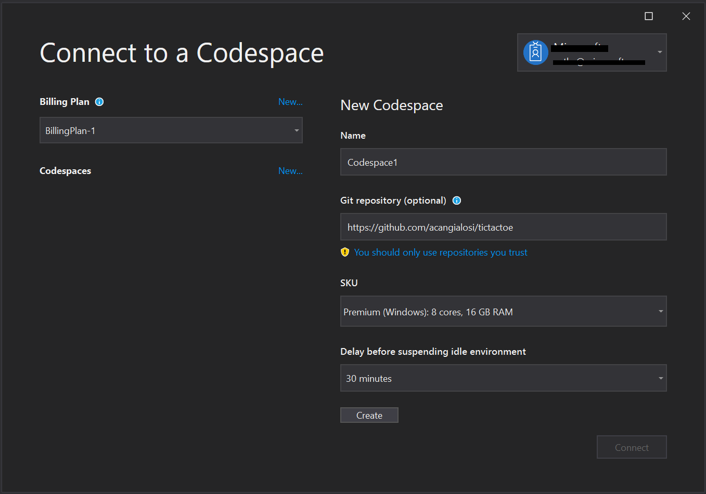
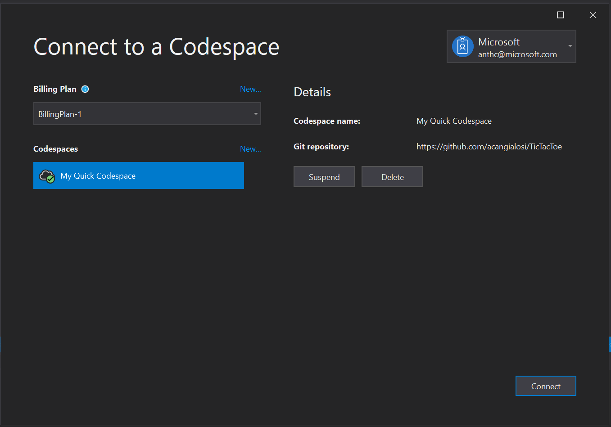
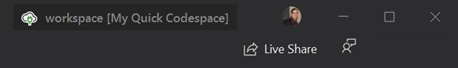
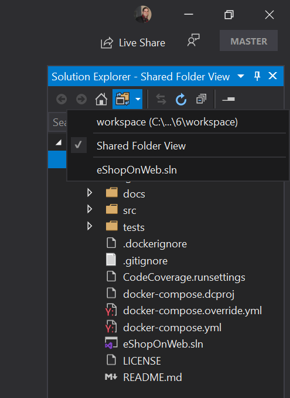
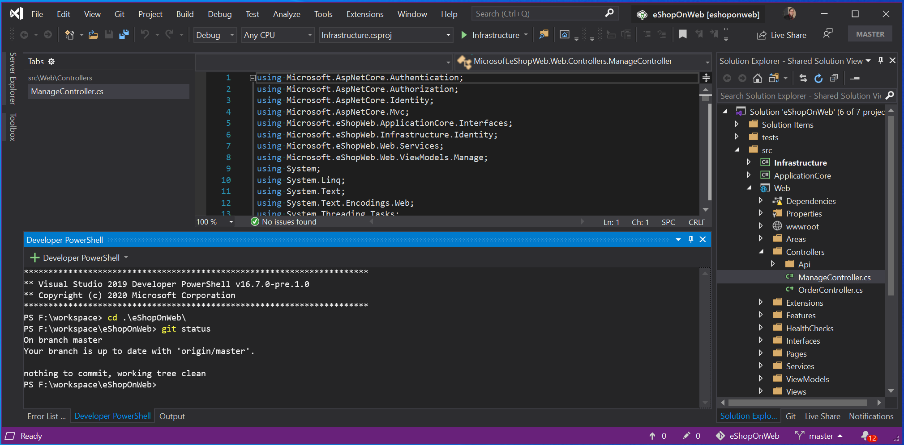

# Visual Studio Codespaces Visual Studio 2019 How-to

This article covers how to get started using Visual Studio 2019 with Visual Studio Codespaces.

## Sign up

A Microsoft Account and Azure Subscription are required to use Visual Studio Codespaces. You can sign up for both at [https://azure.microsoft.com/free/](https://azure.microsoft.com/free/).

Access to the Visual Studio 2019 Private Preview is also required to complete this How-to. Sign up for the Private Preview here [https://aka.ms/vsfutures-signup](https://aka.ms/vsfutures-signup).

## Install

If you don't have [Visual Studio 2019 Preview](https://aka.ms/vspreview) installed already, you can [download it from visualstudio.microsoft.com](https://aka.ms/vspreview).

Once Visual Studio 2019 Preview is installed, follow these steps to set up Codespaces:

1. Open the Visual Studio installer
1. Check the **ASP.NET and web development**, **Desktop development with C++**, or both Workloads in the Installer. Then click **Install**.
1. Launch Visual Studio 2019 from the Start menu. If you just installed Visual Studio for the first time you'll see a welcome screen where you can sign in with any Microsoft identity.
1. On the Visual Studio Start Window click **Continue without code**.
1. Open the **Tools** menu and click **Options...**.
1. Search for **Preview features**.
1. Check the **Connect to Visual Studio Codespaces(private preview only)** checkbox, then click **Ok** and restart Visual Studio.

## Sign in

After you enable the Connect to Visual Studio Codespaces preview feature you will see a new **Connect to a Codespace** button in the Start Window and a new **Connect to a Codespace** command under the File menu.

Click the **Connect to a Codespace** button. If you aren't already signed with an account that has access to the Private Preview, click account picker control to expand it in the upper right corner of the dialog and click **Add an account** to sign in.

## Create a plan

Once you've [signed up](#sign-up) and created an Azure subscription, you can access Visual Studio Codespaces by creating a Billing Plan. You can create more than one plan, and plans can be used to group related Codespaces together or to create Codespaces in different regions. Visual Studio Codespace Billing plans are the unit of billing in Azure, so you'll see a line item on your Azure bill for each plan you create.

Users will not be charged for Windows-based Codespaces created during the Private Preview. For more information about plans and pricing, see [Codespaces pricing](https://aka.ms/vso-pricing).

If this is your first time using Codespaces, click **New...** next to **Billing Plan**.

- **Azure subscription**: You can use any listed Azure subscriptions when creating a billing plan.
- **Resource group name**: Your Billing plan will be created in a new Azure resource group with the name provided in this step.
- **Plan name**: The name of the created Billing plan.
- **Region**: Choose an [Azure region](https://azure.microsoft.com/global-infrastructure/regions/) to create the Billing plan. All environments created within this plan, will be provisioned in the region selected. Supported regions are:
  - East US
  - Southeast Asia
  - West Europe
  - West US 2

Select the Azure subscription where you want to create the Billing plan and a region geographically close to where you'll use Codespaces; then click **Create**.

You can manage plans in the [Azure portal](https://portal.azure.com) and the [Visual Studio Codespaces Portal](https://online.visualstudio.com/environments).

Only environments contained within the selected plan will be displayed. Select a different plan from the drop down on the Connect to a Codespace dialog to see Codespaces created under those plans.

## Create a cloud-hosted Codespace

> [!NOTE]
> Cloud-hosted environments are extremely configurable. See [configuring environments](../reference/configuring.md) for advanced information about how to configure your environments.

To create a new Codespace open the **Connect to a Codespace** dialog using the  **Connect to a Codespace** button in the Start Window or the **Connect to a Codespace** command under the File menu. Then click the **New...** link next to the Codespaces label.

- **Name**: Name your Codespace after the project or task that you'll be using it for. (e.g. 'Todo App Environment', 'PR Review', 'Shopping Cart Feature')
- **Git Repository**: If a path to a Git repository is provided, VS Online will automatically clone that repository into the Codespace. You can specify a Git repository in one of many formats:
  - **Absolute Http(s) Git URL**: A complete Http or Https Url. It may end in a `.git` extension. Examples include:
    - https://github.com/organization/repo.git
    - https://organization@dev.azure.com/organization/repo/_git/repo
    - https://username@bitbucket.org/organization/repo.git
  - **GitHub Project URL**: The Https Url used to navigate to the homepage of a project on GitHub. (e.g. https://github.com/organization/repo)
  - **GitHub Short Form**: The forward slash delimited `organization/repo` format used to refer to projects on GitHub.
  - **GitHub Pull Request URL**: The Https Url used to navigate to a pull request in GitHub. (e.g. https://github.com/organization/repo/pull/123)
- **Instance Type**: The CPU and memory configuration that will be provisioned for your environment. **Premium (Windows)** are the only available instance type initially. **Standard (Windows)** will come online in the near future. Choose **Standard (Windows)** for most projects, and **Premium (Windows)** for those that require a little extra power.
- **Suspend idle Codespace after...**: The length of disconnected time before a Codespace will be automatically suspended. Choose between:
  - 5 minutes
  - 30 minutes
  - 2 hours

The guided environment creation experience described above supports Git repositories over the HTTP(S) scheme. To use another source control provider, or Git over SSH, simply leave the **Git Repository** setting blank, and use the environment's terminal support to clone your source code.

Click **Create** to start provisioning the Codespace. Your new Codespace will immediately appear in the list of available Codespaces with a progress indicator while it's being set up. Codespaces only take about a minute to provision. Once the Codespace is ready the progress indicator will change to an Active status indicator.

> [!NOTE]
> If you let the Codespace sit idle longer than the suspend period the icon will change to a suspended icon.

## Connect to an Codespace

To connect to an existing Codespace open the **Connect to a Codespace** dialog using the  **Connect to a Codespace** button in the Start Window or the **Connect to a Codespace** command under the File menu. Then click the **New...** link next to the Codespaces label.

Press the **Connect** button to connect to the cloud-hosted Codespace you just created.

The name **My Quick Codespace** will appear in the **Remote Indicator** in the title bar when you are fully connected.

If your repository contains solution (.SLN) files click on the **switch views** button in the solution explorer toolbar to see all solution files in the folder and switch between solutions and folders.

Features in Visual Studio generally work the same in a Codespace as they do while working in a local environment. You can edit code, build the application and debug using the same menus, toolbars and shortcuts. Not all Visual Studio features have been enabled  work in a Codespace, yet. Features that aren't yet supported in a Codespace will not appear in the UI when connected to Codespace or will appear with an indicator that they are not yet supported.

## Disconnect from a Codespace

Once connected to a Codespace, there are three ways to disconnect:

1. Open the **File** menu and click **Disconnect from this Codespace**
2. Connect to another Visual Studio Codespace
3. Close the Visual Studio 2019.

## Suspend a Codespace

As described on the [Codespaces pricing page](https://aka.ms/vso-pricing), you pay for active Codespaces usage, with a nominal fee for when an environment is suspended.

Codespaces will automatically suspend an inactive environment according to the auto-suspend settings configured when the environment was created. This helps reduce the cost of Codespaces.

In addition to auto-suspending, you can manually suspend a Codespace at any time by opening the **Connect to a Codespace** dialog, selecting your Codespace in the list and clicking the **Suspend** button.

## Delete a Codespace

You can delete a Codespace at any time by opening the **Connect to a Codespace** dialog, selecting your Codespace in the list and clicking the **Delete** button.

## Using the integrated terminal

Visual Studio's integrated terminal and all of its features are fully supported in a Codespace. It is important to note, however, that while connected to a Codespace, commands issued in the terminal are executed against the Codespace and not the local machine. This provides control over Codespace environment and how it's configured.

## Port Forwarding

Visual Studio Codespaces provides access to the applications and services running in the remote environments by means of port forwarding. By default, no ports are forwarded for security concerns. However, there are several ways to open ports in the Codespace.

### Automatic port forwarding

If your application, or any other, indicates that it is serving content from a local port in the integrated terminal, Visual Studio Codespaces will automatically forward that port and add it to the list of Forwarded Ports.

### Configured port forwarding

If there are one or more ports that should be forwarded by default for a given repository, that can be configured in `devcontainer.json`. See the [configuring environments](../reference/configuring.md) reference for more info.
