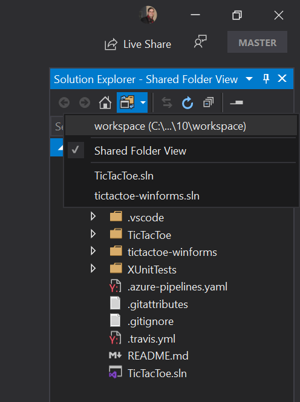

# Visual Studio Codespaces in Visual Studio 2019 Quickstart

Visual Studio Codespaces provides cloud-powered development environments for any activity - whether it's a long-term project, or a short-term task like reviewing a pull request. You can work with these Codespaces from Visual Studio Code, Visual Studio 2019 ([sign up for the Private Preview](https://aka.ms/vsfutures-signup)), or a browser-based editor that's accessible anywhere! You can even connect your own self-hosted Codespaces to Visual Studio Codespaces at no cost.

Additionally, Visual Studio Codespaces brings many of the benefits of DevOps, like repeatability and reliability, which have typically been reserved for production workloads, to development environments. However, Visual Studio Codespaces can be personalized to allow developers to leverage the tools, processes and configurations that they have come to love and rely on - truly the best of both worlds!

This document will walk you through how to install Codespaces, create a cloud-hosted environment, connect to it, run and debug the environment's application, disconnect and delete the environment.

> [!IMPORTANT]
> You must sign up for the Private Preview and have an Azure Subscription to try this quickstart. If you don't already have an Azure Subscription, create one at [https://azure.microsoft.com/free/](https://azure.microsoft.com/free/). Once you have an Azure subscription, [sign up for the Private Preview](https://aka.ms/vsfutures-signup).

## 1. Install

> [!TIP]
> If you don't have [Visual Studio 2019 Preview](https://aka.ms/vspreview) installed already, you can download it [here](https://aka.ms/vspreview).

Check the **ASP.NET and web development**, **Desktop development with C++**, or both Workloads in the Installer. Then click **Install**.

Once Visual Studio 2019 Preview is installed, follow these steps to enable Codespaces:

1. Launch Visual Studio 2019 from the Start menu. If you just installed Visual Studio for the first time you'll see a welcome screen where you can sign in with any Microsoft identity.
1. On the Visual Studio Start Window click **Continue without code**.
1. Open the **Tools** menu and click **Options...**.
1. Search for **Preview features**.
1. Check the **Connect to Visual Studio Codespaces(private preview only)** checkbox, then click **Ok**
1. Restart Visual Studio.

## 2. Create a Codespace

After you enable the Connect to Visual Studio Codespases preview feature you will see a new **Connect to a Codespace** button in the Start Window and a new **Connect to a Codespace** command under the File menu. Click the **Connect to a Codespace** button. If you aren't already signed with an account that has access to the Private Preview, click account picker control to expand it in the upper right corner of the dialog and click **Add an account** to sign in.

If this is your first time using Codespaces, click **New...** next to **Billing Plan**. Select the Azure subscription where you want to create the Billing plan and a region geographically close to where you'll use Codespaces; then click **Create**.

To create a new cloud-hosted Codespace in Visual Studio Codespaces select the **New...** button next to the **Codespaces** label.

Enter the following information then click the **Create** button:

- **Name**: My Quick Codespace
- **Git Repository**: acangialosi/tictactoe
- **Instance type**: Premium (Windows): 8 cores, 16 GB RAM
- **Suspend idle Codespace after...**: 30 minutes

**My Quick Codespace** will appear under the **Codespaces** list with an indeterminent progress indicator while the Codespace is provisioned. When the Codespace is ready to connect a green check will appear next to **My Quick Codespace**.

## 3. Connect and use the Codespace

Press the **Connect** button to connect to the cloud-hosted Codespace you just created.

The name **My Quick Codespace** will appear in the **Remote Indicator** in the title bar when you are fully connect.

Click on the **switch views** button in the solution explorer toolbar and click **tictactoe.sln** to load the solution.

Click [`Ctrl`]+[`Shift`]+[`B`] to build the application.

Add a breakpoint on line 31.

Press [`F5`] to launch the app. Once the breakpoint is hit try stepping, examining locals and more.

Press [`F5`] again to continue execution and see the running app.

## 4. Delete the Codespace

To delete the newly created Codespace, open the **File** menu and click **Connect to a Codespace**. Select **My Quick Codespace** and click the **Delete** button.

## Next Steps

This article covered a typical end-to-end use of Codespaces. For more information, see:

- [What is Codespaces?](../overview/what-is-vsonline.md)
- [Codespaces with VS Code quickstart](../quickstarts/vscode.md)
- [Codespaces with the browser quickstart](../quickstart/browser.md)
