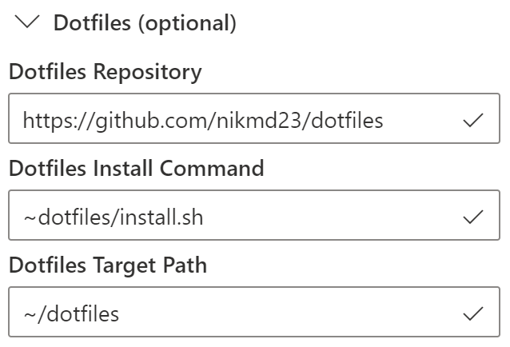
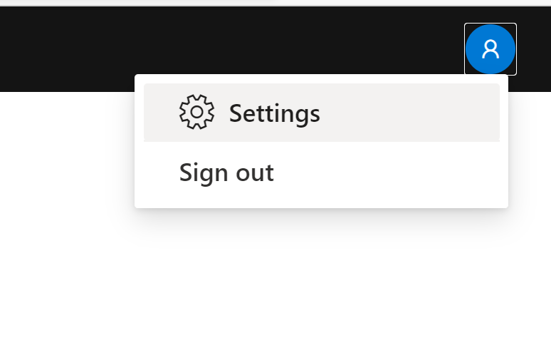
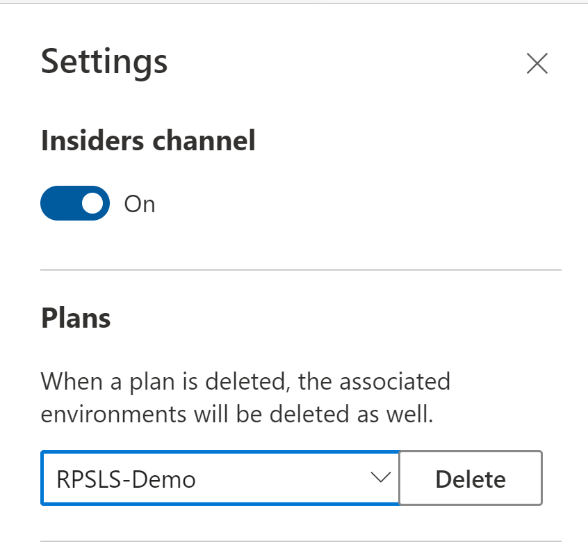

# Personalize Visual Studio Online with dotfiles

Visual Studio Codespaces's [environments](../overview/what-is-vsonline.md#environments) are fully personalizable on a per user basis. This is accomplished by referencing a "dotfiles repo" at environment creation time.

- [Enable personalization settings sync in Visual Studio Code](#enable-personalization-settings-sync-in-visual-studio-code).
- [Configure a dotfile repo during environment creation](#configure-a-dotfile-repo-during-environment-creation).

Dotfiles are files whose filename begins with a dot (`.`). They typically contain configuration information for an application. They are used to control the way terminals, editors, source control, and other tools behave. Examples of dotfiles include `.bashrc`, `.gitignore`, and `.editorconfig`.

Developers often store dotfiles in a GitHub repository so they can easily synchronize them between development environments. For more information, see [GitHub Dotfiles](https://dotfiles.github.io/) on GitHub.io.

## Enable personalization settings sync in Visual Studio Code

To configure a dotfiles repo in Visual Studio Code:
Press `F1` and select the **Preferences: Open Setting (UI)** command in the [command palette](https://code.visualstudio.com/docs/getstarted/userinterface#_command-palette). In the **Settings** tab that opens, select the **Extensions** node in the navigation tree, followed by **Visual Studio Codespaces**. 

## Configure a dotfile repo during environment creation

You can also configure dotfiles using the [Visual Studio Online portal](https://online.visualstudio.com). Press the **Create environment** button and expand the **Dotfiles (optional)** settings.

In both experiences, there are three options that can be configured:

1. **Dotfiles Repository**: The URL of the Git repository containing your dotfiles. (*Required to personalize an environment, optional otherwise*)
2. **Dotfiles Target Path**: The path where the dotfiles repo will be cloned. Defaults to `~dotfiles`. (*Optional*)

3. **Dotfiles Install Command**: The command to run after cloning the dotfiles repository. By default, Codespaces scans the dotfiles repository and runs one of the following files:
    - `install.sh`
    - `install`
    - `bootstrap.sh`
    - `bootstrap`
    - `setup.sh`
    - `setup`

If none of these files are found, any files and folders starting with `.` are symlinked to the home (`~` or `$HOME` on Linux) directory.

Once the **Dotfiles Repository** is configured in VS Code, any environments created going forward will use the personalized settings.

## Enable personalization settings sync in Visual Studio Code

> ![NOTE]
> Settings Sync is currently in Preview and is only available in Visual Studio Code Insiders.

[Settings Sync](https://code.visualstudio.com/docs/editor/settings-sync) allows you to sync a variety of settings, such as theme, keyboard shortcuts, extensions, and more across your various Visual Studio Code instances to give you tooling consistency whether you're working from a local Visual Studio Code instance or the browser-based editor.

To use settings sync, ensure you're connecting to your environment from within Visual Studio Code Insiders or enable Insiders for the browser based editor:

- Navigate to the **Settings** pane from the user account card.

  

- Toggle the **Insiders channel** option to on.

  

Once you're connected to the environment:

- Click the **Manage** gear menu at the bottom of the **Activity Bar**.
- Enable the **Turn On Preferences Sync..** option.

For more information and troubleshooting Settings Sync, check out the [Visual Studio Code documentation](https://code.visualstudio.com/docs/editor/settings-sync).
